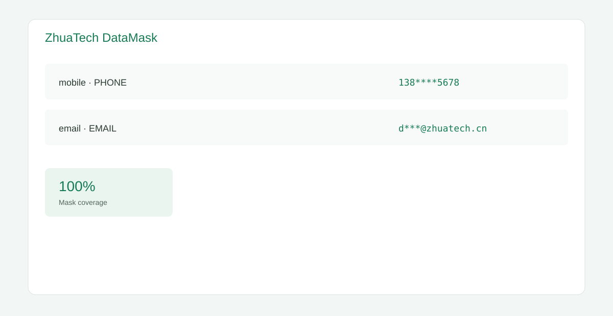

# ZhuaTech DataMask · 知华数据脱敏工具

上海如静知华信息科技有限公司社区源码工具，面向开发、测试和数据交换场景提供可解释的字段脱敏预览。[官网](https://www.zhuatech.cn/)



支持姓名、手机号、邮箱、身份证、银行卡和通用文本掩码；接口 `POST /api/datamask/preview` 返回逐字段结果、覆盖率和未支持类型。技术栈为 Java 21、Spring Boot、响应式 H5 与 MySQL。

本机演示可直接执行：

```bash
docker compose up -d --wait mysql
cd backend && mvn spring-boot:run
```

然后打开 `frontend/index.html`。MySQL 仅监听 `127.0.0.1:3308`；仓库内默认口令只用于本机演示。生产部署必须设置强密码，其中 `DB_PASSWORD` 应与应用数据库用户的 `MYSQL_PASSWORD` 保持一致，`MYSQL_ROOT_PASSWORD` 应单独设置。

本项目仅供个人学习、研究和非商业交流，**不得商用**。企业内部使用、生产部署、SaaS、客户交付和收费服务须取得上海如静知华信息科技有限公司书面授权，详见 [LICENSE](LICENSE)。深度开发请联系知华科技：

| 微信咨询一 | 微信咨询二 |
|---|---|
|  |  |

SEO：数据脱敏工具、隐私数据掩码、测试数据、Java 数据安全工具、知华科技。

## 企业级数据脱敏任务发布

新增 `POST /api/enterprise/datamask/masking-job-release`，覆盖访问授权、分类、规则、不可逆性、关联一致性、输出权限、预演和审计，返回 `EXECUTE / PILOT / BLOCKED`。详见 [脱敏发布说明](docs/ENTERPRISE_MASKING_JOB_RELEASE.md)。
